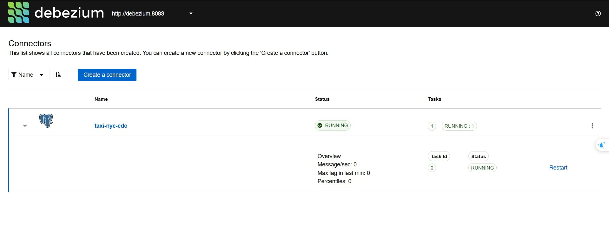
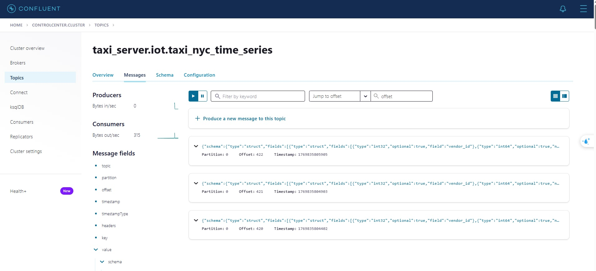
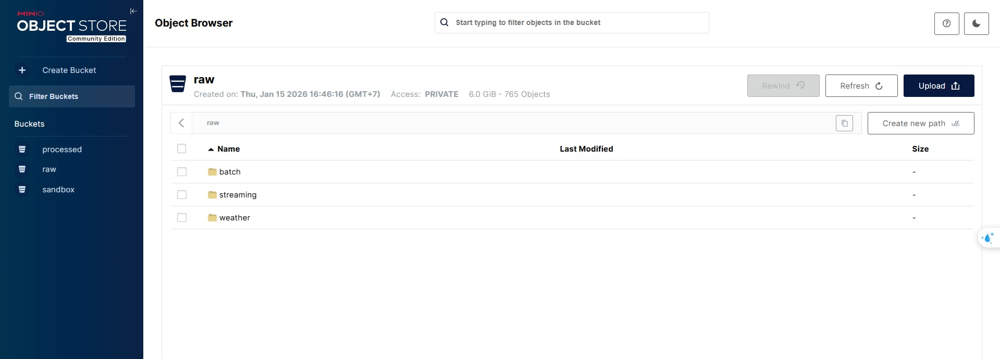
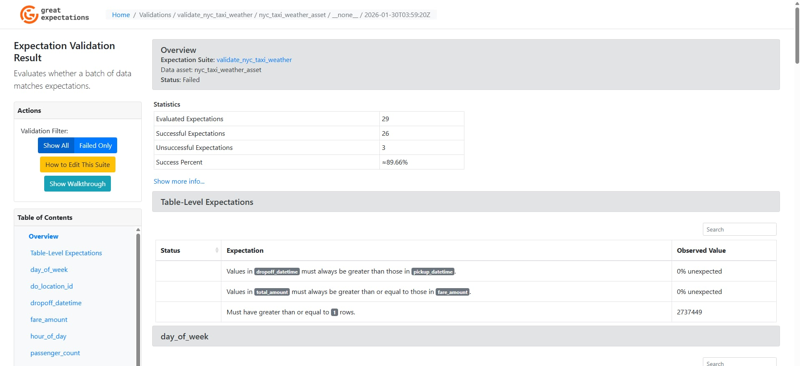
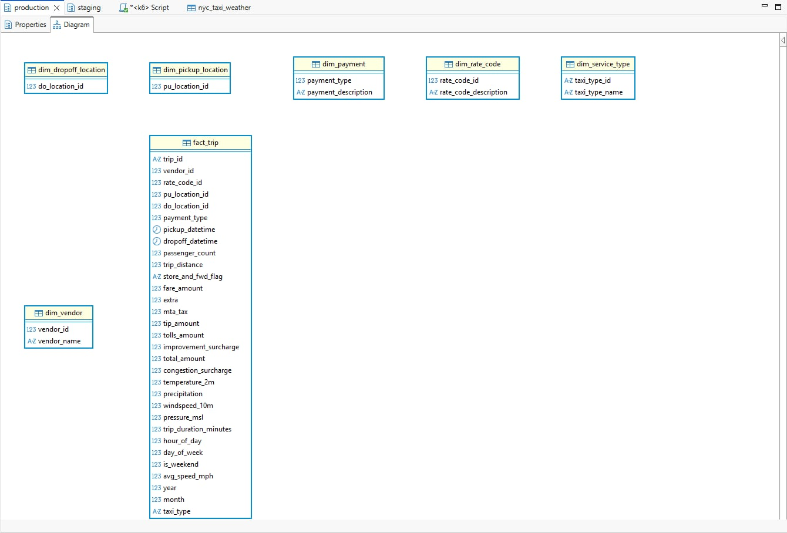
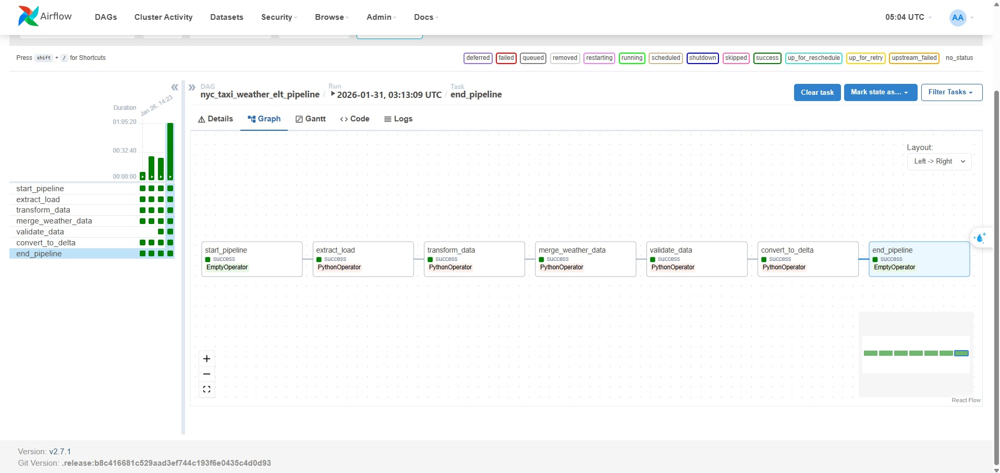

# 🚕 NYC Taxi Weather Prediction Pipeline 🌦️

A real-time data pipeline that combines NYC taxi trip data with weather information for predictive analytics. This project leverages **Airflow, Spark, MinIO, Debezium, Kafka, dbt**, and **Great Expectations** to process streaming taxi data enriched with weather metrics.

# 💥 Challenge: Real-Time Data Integration with Weather

Traditional taxi analytics lack environmental context. Our pipeline addresses this by:
- **Real-time CDC**: Capturing taxi trip changes as they happen
- **Weather Enrichment**: Combining trip data with temperature, precipitation, wind, and pressure
- **Streaming Architecture**: Processing data in near real-time for predictive modeling

# 📕 Table Of Contents

<!--ts-->
- 🌟 [System Architecture](#-system-architecture)
- 📁 [Repository Structure](#-repository-structure)
- 🚀 [Getting Started](#-getting-started)
- 🔍 [How to Guide](#-how-to-guide)
- 📌 [References](#-references)
<!--te-->

# 🌟 System Architecture

<p align="center">


<p align="center">
    Real-Time Streaming Architecture with CDC
</p>

## Data Flow

```
Raw Data (Parquet)
    ↓
PostgreSQL (iot.taxi_nyc_time_series) + Weather API
    ↓ (Debezium CDC)
Kafka (taxi_server.iot.taxi_nyc_time_series)
    ↓ (Spark Streaming)
MinIO DataLake (s3a://raw/streaming/nyc_taxi_iot/)
    ↓ (Airflow ETL)
Staging (staging.nyc_taxi_weather)
    ↓ (dbt Transformation)
Production (Star Schema: dim_*, fact_trip)
    ↓
Analytics & ML Models
```

# 📁 Repository Structure

```shell
.
├── airflow/                                    # Airflow DAGs & configs
│   ├── dags/
│   │   └── weather_etl_dag.py                 # Main ETL orchestration
│   └── docker-compose.yaml
├── batch_processing/
│   └── datalake_to_dw.py                      # Batch ETL from DataLake to Staging
├── config/
│   ├── spark.yaml                              # Spark configurations
│   └── datalake.yaml                           # MinIO configurations
├── data/                                       # Raw parquet files
│   ├── yellow_tripdata_2023-*.parquet
│   └── green_tripdata_2023-*.parquet
├── data_validation/                            # Great Expectations
│   ├── gx/
│   │   ├── checkpoints/
│   │   └── expectations/
│   └── validate_streaming.ipynb
├── dbt_nyc/                                    # dbt transformations
│   ├── models/
│   │   ├── staging/
│   │   │   └── sources.yml
│   │   └── production/
│   │       ├── fact_trip.sql
│   │       ├── dim_vendor.sql
│   │       ├── dim_payment.sql
│   │       ├── dim_rate_code.sql
│   │       ├── dim_pickup_location.sql
│   │       ├── dim_dropoff_location.sql
│   │       ├── dim_service_type.sql
│   │       └── schema.yml
│   ├── macros/
│   │   ├── get_vendor_description.sql
│   │   ├── get_payment_description.sql
│   │   ├── get_rate_code_description.sql
│   │   └── get_taxi_type_name.sql
│   └── dbt_project.yml
├── debezium/                                   # CDC configuration
│   ├── configs/
│   │   └── taxi-nyc-iot-cdc.json              # Debezium connector config
│   └── run.sh                                  # Register connector script
├── stream_processing/
│   ├── streaming_to_datalake.py               # Kafka → MinIO streaming
│   └── schema_config.json                      # CDC schema definition
├── utils/                                      # Helper scripts
│   ├── create_schema.py                        # Create PostgreSQL schemas
│   ├── create_table.py                         # Create tables (iot, staging)
│   ├── streaming_data_db.py                    # Stream parquet → PostgreSQL
│   ├── helpers.py                              # General utilities
│   ├── minio_utils.py                          # MinIO client
│   └── postgresql_client.py                    # PostgreSQL client
├── .env                                        # Environment variables
├── docker-compose.yaml                         # Main services 
├── requirements.txt
└── README.md
```

# 🚀 Getting Started

## Prerequisites

- Docker & Docker Compose
- Python 3.9+
- Conda (recommended)
- MinIO CLI (`mc`)

## Setup

### 1. Clone the repository

```bash
git clone https://github.com/dazetw/nyc-taxi-weather-prediction
cd nyc-taxi-weather-prediction
```

### 2. Create environment variables

```bash
cp .env.example .env
# Edit .env with your credentials
```

**`.env` Example:**
```env
# PostgreSQL
POSTGRES_HOST=localhost
POSTGRES_PORT=5434
POSTGRES_DB=nyc_taxi_db
POSTGRES_USER=airflow
POSTGRES_PASSWORD=airflow

# MinIO
MINIO_ENDPOINT=localhost:9000
MINIO_ACCESS_KEY=minio
MINIO_SECRET_KEY=minio123
BUCKET_NAME=raw

# Kafka
KAFKA_BOOTSTRAP_SERVERS=localhost:9092
KAFKA_TOPIC=taxi_server.iot.taxi_nyc_time_series
```

### 3. Start infrastructure

```bash
# Start all services (Kafka, Zookeeper, Debezium, MinIO, PostgreSQL)
docker-compose up -d

# Check services are running
docker-compose ps
```

### 4. Setup Python environment

```bash
conda create -n bigdata python=3.9
conda activate bigdata
pip install -r requirements.txt
```

### 5. Initialize MinIO

```bash
# Configure MinIO client
mc alias set minio http://localhost:9000 minio minio123

# Create buckets
mc mb minio/raw
mc mb minio/processed
mc mb minio/delta

# Verify buckets
mc ls minio/
```

### 6. Download Dataset

Download NYC Taxi Trip Data from:
https://www.nyc.gov/site/tlc/about/tlc-trip-record-data.page

Place parquet files in `./data/` directory:
```
data/
├── yellow_tripdata_2023-01.parquet
├── yellow_tripdata_2023-02.parquet
└── green_tripdata_2023-01.parquet
```

### 7. Access Services

| Service | URL | Credentials |
|---------|-----|-------------|
| **Kafka Control Center** | http://localhost:9021 | - |
| **Debezium** | http://localhost:8083 | - |
| **MinIO Console** | http://localhost:9001 | minio / minio123 |
| **Airflow** | http://localhost:8080 | airflow / airflow |
| **PostgreSQL** | localhost:5432 | airflow / airflow |

---

# 🔍 How to Guide

## I. Setup Database & Schemas

### 1. Create PostgreSQL schemas

```bash
python utils/create_schema.py
```

**Output:**
```
✅ Schema 'iot' created successfully!
✅ Schema 'staging' created successfully!
✅ Schema 'production' created successfully!
```

### 2. Create IoT table

```bash
python utils/create_table.py
```

Creates `iot.taxi_nyc_time_series` table with:
- Trip details (vendor, pickup/dropoff times, locations)
- Payment info (fare, tips, tolls, total)
- Weather fields (temperature, precipitation, wind, pressure)

---

## II. Streaming Pipeline Setup

### 1. Register Debezium CDC Connector

```bash
cd debezium/
bash run.sh register_connector configs/taxi-nyc-iot-cdc.json
```

**Verify connector:**
```bash
curl http://localhost:8083/connectors/taxi-nyc-iot-cdc/status
```

<p align="center">

<p align="center">Debezium Connector Status</p>
</p>

### 2. Start Spark Streaming (Terminal 1)

```bash
python stream_processing/streaming_to_datalake.py
```

**Expected Output:**
```
✅ Spark session successfully created!
✅ Initial dataframe created successfully!
📊 Subscribing to Kafka topic: taxi_server.iot.taxi_nyc_time_series
✅ Final dataframe created successfully with derived features!
🚀 Streaming is being started...
✅ Streaming data to: s3a://raw/streaming/nyc_taxi_iot/
⏳ Waiting for data...
```

### 3. Stream Data to PostgreSQL (Terminal 2)

```bash
python utils/streaming_data_db.py
```

**Expected Output:**
```
✅ Table columns: Index(['vendor_id', 'pickup_datetime', ...])
📊 Loaded 100 rows from parquet
🚀 Starting to stream data to iot.taxi_nyc_time_series...
✅ [1/100] Sent: {'vendor': 1, 'pickup': '2023-01-01 00:32:10', ...}
✅ [2/100] Sent: {'vendor': 2, 'pickup': '2023-01-01 00:55:08', ...}
...
```

### 4. Monitor Kafka Topic

Access Kafka Control Center: http://localhost:9021

Navigate to: **Topics → taxi_server.iot.taxi_nyc_time_series**

<p align="center">

<p align="center">CDC Events in Kafka Topic</p>
</p>

### 5. Check MinIO for Streamed Data

```bash
mc ls minio/raw/streaming/nyc_taxi_iot/

# Or use MinIO Console: http://localhost:9001
```

<p align="center">

<p align="center">Streaming Data in MinIO</p>
</p>

---

## III. Batch ETL Processing

### 1. Load Data from DataLake to Staging

```bash
python batch_processing/datalake_to_dw.py
```

**What it does:**
- Reads parquet files from MinIO (`s3a://raw/streaming/nyc_taxi_iot/`)
- Enriches with weather data
- Writes to PostgreSQL (`staging.nyc_taxi_weather`)

**Expected Output:**
```
✅ Spark session created
📊 Reading data from MinIO...
🌦️ Enriching with weather data...
💾 Writing to staging.nyc_taxi_weather...
✅ Loaded 1,234,567 records to staging
```

### 2. Validate Data Quality

```bash
cd data_validation
jupyter notebook validate_streaming.ipynb
```

Run all cells to validate:
- ✅ No null values in critical columns
- ✅ Valid vendor IDs (1, 2)
- ✅ Positive trip distances
- ✅ Reasonable fare amounts

<p align="center">

<p align="center">Great Expectations Validation Results</p>
</p>

---

## IV. dbt Transformation (Star Schema)

### 1. Configure dbt

```bash
cd dbt_nyc
dbt debug
```

### 2. Run dbt Models

```bash
# Build all models
dbt run

# Or run incrementally
dbt run --select staging.*
dbt run --select production.*
```

**Expected Output:**
```
Running with dbt=1.6.5
Found 7 models, 21 tests, 1 source...

1 of 7 START sql table model production.dim_vendor ............... [RUN]
1 of 7 OK created sql table model production.dim_vendor .......... [SELECT 2 in 0.25s]

2 of 7 START sql table model production.dim_rate_code ............ [RUN]
2 of 7 OK created sql table model production.dim_rate_code ....... [SELECT 6 in 0.18s]

3 of 7 START sql table model production.dim_payment .............. [RUN]
3 of 7 OK created sql table model production.dim_payment ......... [SELECT 6 in 0.22s]

4 of 7 START sql table model production.dim_service_type ......... [RUN]
4 of 7 OK created sql table model production.dim_service_type .... [SELECT 2 in 0.19s]

5 of 7 START sql table model production.dim_pickup_location ...... [RUN]
5 of 7 OK created sql table model production.dim_pickup_location . [SELECT 265 in 0.31s]

6 of 7 START sql table model production.dim_dropoff_location ..... [RUN]
6 of 7 OK created sql table model production.dim_dropoff_location  [SELECT 265 in 0.29s]

7 of 7 START sql table model production.fact_trip ................ [RUN]
7 of 7 OK created sql table model production.fact_trip ........... [SELECT 1,234,567 in 2.45s]

Done. PASS=7 WARN=0 ERROR=0 SKIP=0 TOTAL=7
```

### 3. Test Data Quality

```bash
dbt test
```

### 4. Generate Documentation

```bash
dbt docs generate
dbt docs serve

# Open browser: http://localhost:8080
```


### 5. Star Schema Result

```
📊 Star Schema:

         dim_vendor (2 rows)
               ↓
         dim_payment (6 rows)
               ↓
    dim_pickup_location (265 rows) → fact_trip (1M+ rows) ← dim_rate_code (6 rows)
               ↑                                  ↑
    dim_dropoff_location (265 rows)    dim_service_type (2 rows)
```

<p align="center">

<p align="center">Data Warehouse - Star Schema</p>
</p>

---

## V. Airflow Orchestration

### 1. Start Airflow

```bash
cd airflow/
docker-compose up -d
```

### 2. Access Airflow UI

Open: http://localhost:8080

**Login:** airflow / airflow

### 3. Enable DAG

Find `nyc_taxi_weather_etl` DAG and toggle it **ON**

<p align="center">

<p align="center">Airflow DAG - Taxi Weather ETL</p>
</p>

### 4. DAG Tasks

```
start
  ↓
check_minio_connection
  ↓
spark_etl_to_staging
  ↓
validate_data_quality
  ↓
dbt_run_staging
  ↓
dbt_test_staging
  ↓
dbt_run_production
  ↓
dbt_test_production
  ↓
end
```

---

## VI. Query Production Data

### Example Queries

````sql
-- Top 10 busiest pickup locations
SELECT 
    pl.pu_location_id,
    COUNT(*) as trip_count,
    AVG(f.total_amount) as avg_fare
FROM production.fact_trip f
JOIN production.dim_pickup_location pl ON f.pu_location_id = pl.pu_location_id
GROUP BY pl.pu_location_id
ORDER BY trip_count DESC
LIMIT 10;

-- Weather impact on fares
SELECT 
    CASE 
        WHEN f.temperature_2m < 0 THEN 'Freezing'
        WHEN f.temperature_2m < 10 THEN 'Cold'
        WHEN f.temperature_2m < 20 THEN 'Mild'
        ELSE 'Warm'
    END as temp_category,
    AVG(f.total_amount) as avg_fare,
    AVG(f.trip_distance) as avg_distance,
    COUNT(*) as trip_count
FROM production.fact_trip f
GROUP BY temp_category
ORDER BY avg_fare DESC;

-- Payment type distribution
SELECT 
    dp.payment_description,
    COUNT(*) as trips,
    SUM(f.total_amount) as total_revenue
FROM production.fact_trip f
JOIN production.dim_payment dp ON f.payment_type = dp.payment_type
GROUP BY dp.payment_description
ORDER BY total_revenue DESC;

-- Hourly trip patterns
SELECT 
    f.hour_of_day,
    f.is_weekend,
    COUNT(*) as trips,
    AVG(f.total_amount) as avg_fare,
    AVG(f.trip_duration_minutes) as avg_duration
FROM production.fact_trip f
GROUP BY f.hour_of_day, f.is_weekend
ORDER BY f.hour_of_day;